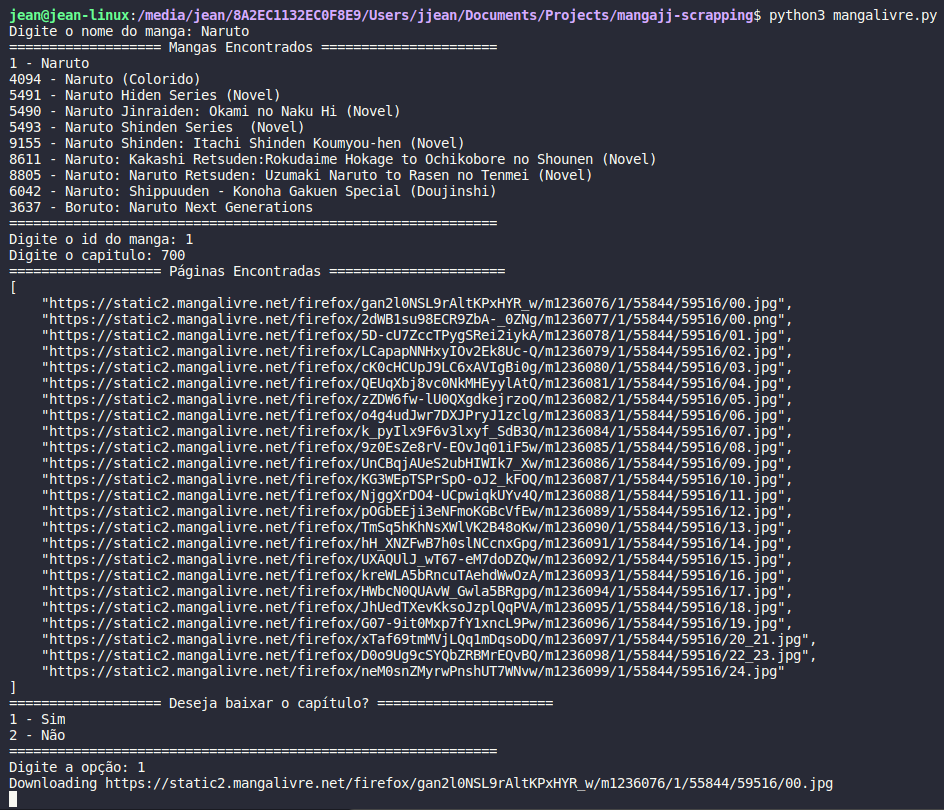

# Manga Scrapping Command Line Tool

Ferramenta de linha de comando para baixar mangás de sites de leitura online.

## Requerimentos 

- [Python 3.6+](https://www.python.org/)
- Pipenv
- [BeautifulSoup4](https://pypi.org/project/beautifulsoup4/)
- [Requests](https://pypi.org/project/requests/)

## Rodando o projeto

1. Clone o repositório
2. Instale as dependências com o comando `pip install -r requirements.txt`
3. Execute o arquivo `mangalivre.py` ou `muitomanga.py` com o comando `python mangalivre.py`

## Licença

[MIT](https://choosealicense.com/licenses/mit/)

---
Developed by [Jean Jacques Barros](https://github.com/jjeanjacques10)